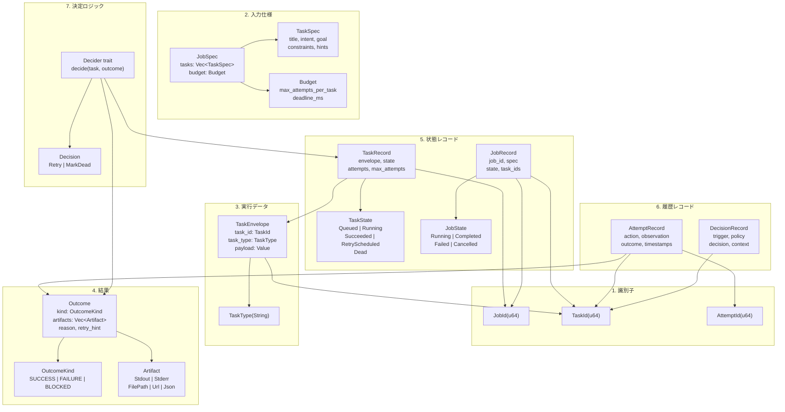
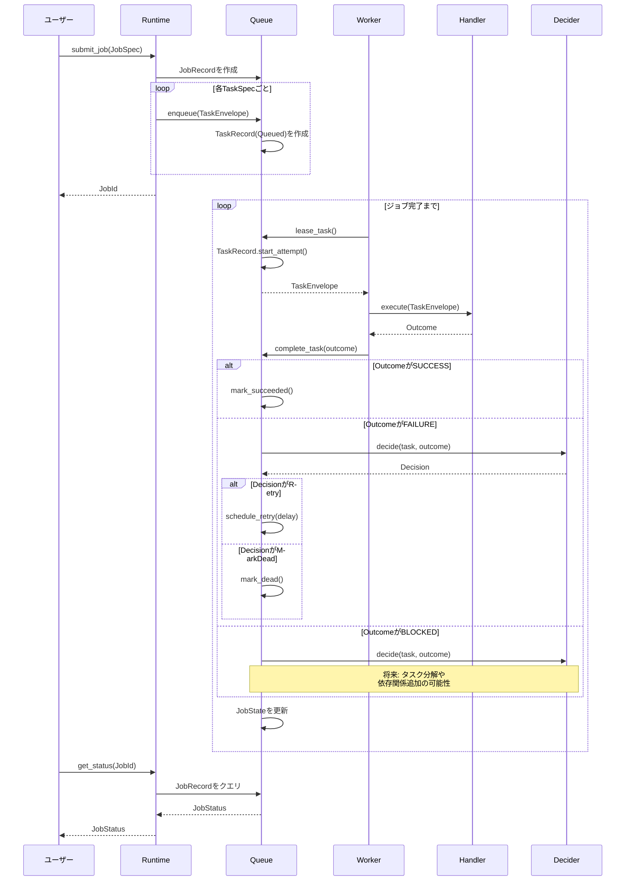
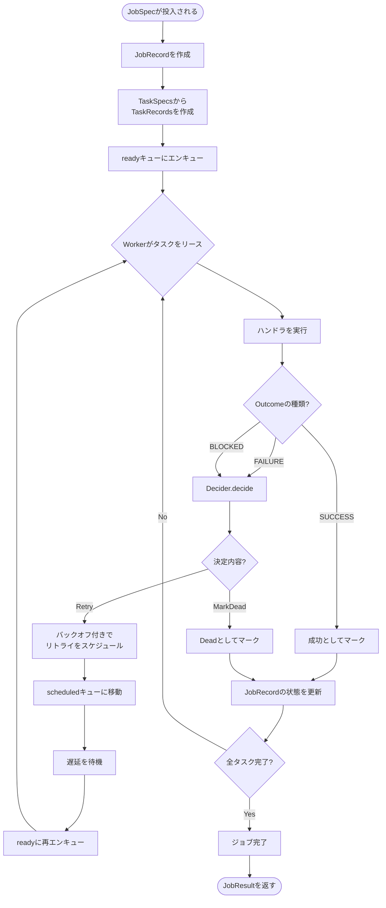
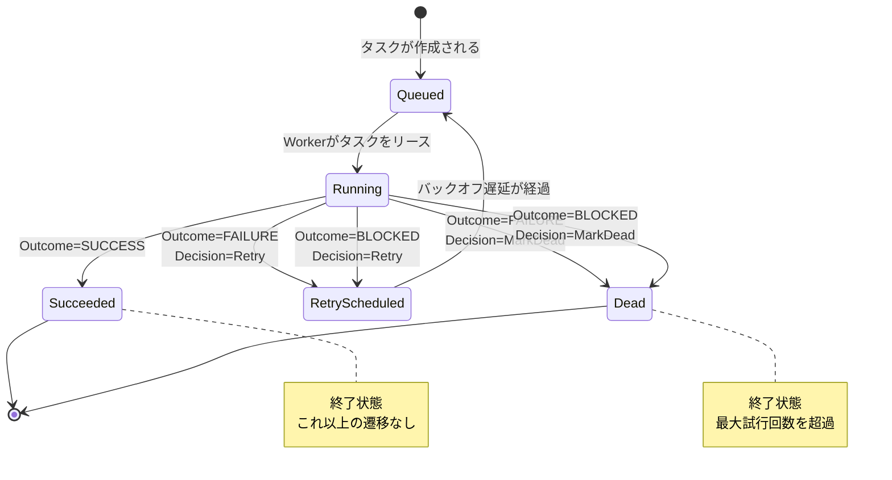
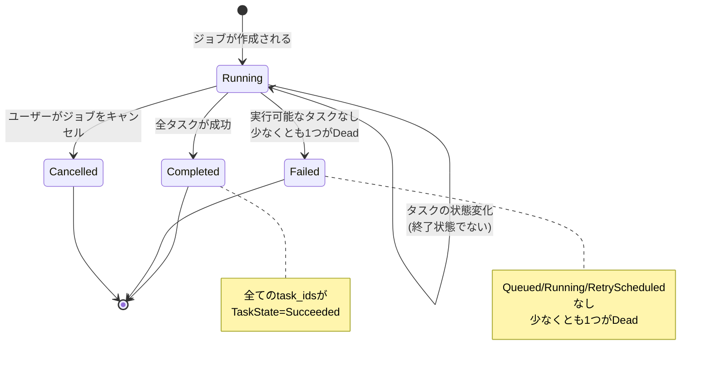

# Weaver アーキテクチャドキュメント

**バージョン**: v1 (2025-12-30)
**ステータス**: 開発中

## 目次

- [概要](#概要)
- [レイヤーアーキテクチャ](#レイヤーアーキテクチャ)
- [型システム概要](#型システム概要)
- [データフロー](#データフロー)
- [状態遷移](#状態遷移)
- [コア構造リファレンス](#コア構造リファレンス)
- [使用例](#使用例)
- [設計決定](#設計決定)

---

## 概要

Weaver は以下の原則で構築されたタスク実行エンジンです：

- **強い型付けされたID**: 異なる識別子タイプ（JobId、TaskId、AttemptId）の混同を防ぐ
- **代数的データ型**: 網羅的なマッチングを持つenumを使用してロジックの穴を防ぐ
- **関数型の決定ロジック**: Deciderは純粋関数（状態 + 観測 → 次のアクション）
- **副作用の分離**: 実行（Runners）に副作用を含め、その他はすべて純粋
- **完全な可観測性**: すべての試行、決定、結果が記録される

### 主要な特徴（v1）

- **シングルプロセス**: 分散協調なし
- **インメモリ状態**: 永続化は後でプラグイン可能
- **キャンセル可能**: `get_status()` と `cancel_job()` 操作をサポート
- **予算認識**: 最大試行回数、デッドライン、スタック検出を尊重

---

## レイヤーアーキテクチャ

```
┌─────────────────────────────────────────────────────────┐
│                  CLI / アプリケーション                  │
│                   (weaver-cli crate)                    │
└─────────────────────────────────────────────────────────┘
                           │
                           ▼
┌─────────────────────────────────────────────────────────┐
│                   Runtime / Worker                      │
│            (オーケストレーション & 並行実行)              │
│   - Runtime: HandlerRegistry + ジョブ投入               │
│   - Worker: タスクリース、実行、結果報告                 │
└─────────────────────────────────────────────────────────┘
                           │
                           ▼
┌─────────────────────────────────────────────────────────┐
│                      キューレイヤー                       │
│               (状態管理 & スケジューリング)               │
│   - InMemoryQueue: タスク保存 & リース                   │
│   - TaskRecord: 状態マシン & 遷移                        │
│   - RetryPolicy: バックオフ計算                          │
└─────────────────────────────────────────────────────────┘
                           │
                           ▼
┌─────────────────────────────────────────────────────────┐
│                     ドメインモデル                        │
│            (純粋な型、インフラなし)                       │
│   - IDs: JobId, TaskId, AttemptId                       │
│   - Specs: JobSpec, TaskSpec, Budget                    │
│   - Outcomes: Outcome, OutcomeKind, Artifact            │
│   - Records: JobRecord, AttemptRecord, DecisionRecord   │
│   - Decisions: Decision, Decider trait                  │
└─────────────────────────────────────────────────────────┘
```

### レイヤーの責務

| レイヤー | 責務 | 主要な抽象化 |
|-------|------|-------------|
| **Domain** | 純粋な型、ビジネスロジック、インフラなし | IDs, Specs, Outcomes, Records |
| **Queue** | 状態管理、スケジューリング、タスクライフサイクル | TaskRecord, TaskState, InMemoryQueue |
| **Runtime** | オーケストレーション、ハンドラディスパッチ、並行性 | Runtime, Worker, HandlerRegistry |
| **CLI/App** | ユーザーインターフェース、実装例 | Commands, example handlers |

---

## 型システム概要

### コアとなる型のカテゴリー



---

## データフロー

### ジョブ投入から完了まで



### タスクライフサイクル



---

## 状態遷移

### TaskState の遷移



### JobState の遷移



---

## コア構造リファレンス

### 1. 識別子 (`domain/ids.rs`)

| 型 | 目的 | 表現 |
|------|---------|----------------|
| `JobId` | 投入/キャンセル/ステータスの単位 | `u64` のNewtypeラッパー |
| `TaskId` | Job内の最小追跡可能単位 | `u64` のNewtypeラッパー |
| `AttemptId` | Taskの1回の実行試行 | `u64` のNewtypeラッパー |

**設計根拠**: Newtypeパターンにより、コンパイル時に異なるID型の混同を防ぐ（ADR-0001参照）。

```rust
// 例: 型安全性の実践
let job_id = JobId::new(1);
let task_id = TaskId::new(1);
// let _: JobId = task_id; // <- コンパイルエラー！型を混在できない
```

### 2. 入力仕様 (`domain/spec.rs`)

#### JobSpec

```rust
pub struct JobSpec {
    pub tasks: Vec<TaskSpec>,
    pub budget: Budget,
}
```

- **目的**: システムへの投入単位
- **ライフサイクル**: ユーザーが作成 → RuntimeがJobRecordを作成
- **柔軟性**: `Vec<TaskSpec>` を使用してジョブごとに複数タスクをサポート

#### TaskSpec

```rust
pub struct TaskSpec {
    pub title: Option<String>,
    pub intent: Option<String>,
    pub goal: Option<serde_json::Value>,
    pub constraints: Option<serde_json::Value>,
    pub seed_action_hint: Option<serde_json::Value>,
    pub dependencies_hint: Option<serde_json::Value>,
}
```

- **目的**: 実行すべき内容の宣言的な記述
- **柔軟性**: ドメイン固有フィールドに `serde_json::Value` を使用（v1設計）
- **進化**: 既存コードを壊さずに新しいフィールドを追加可能

#### Budget

```rust
pub struct Budget {
    pub max_attempts_per_task: u32,
    pub max_total_attempts: Option<u32>,
    pub deadline_ms: Option<u64>,
    pub max_no_progress_steps: Option<u32>,
}
```

- **目的**: 無限ループを防ぐための実行制約
- **デフォルト**: タスクあたり5回の試行、50回の進捗なしステップ
- **v1スコープ**: 基本的な試行制限、将来的にはコスト予算を追加予定

### 3. 実行データ (`domain/task.rs`)

#### TaskEnvelope

```rust
pub struct TaskEnvelope {
    task_id: TaskId,
    task_type: TaskType,
    payload: serde_json::Value,
}
```

- **目的**: ハンドラへの「配送パッケージ」（ID + タイプ + データ）
- **パターン**: ハンドラはWorkerからこれを受け取る
- **設計**: 不変、実行中のロックを避けるためArcで渡される（ADR-0003参照）

#### TaskType

```rust
pub struct TaskType(String);
```

- **目的**: ハンドラディスパッチキー（例: "http_request", "shell_command"）
- **パターン**: RuntimeはこれをHandlerRegistryでハンドラを検索するために使用

### 4. 結果 (`domain/outcome.rs`)

#### Outcome

```rust
pub struct Outcome {
    pub kind: OutcomeKind,
    pub artifacts: Vec<Artifact>,
    pub reason: Option<String>,
    pub retry_hint: Option<serde_json::Value>,
    pub alternatives: Vec<serde_json::Value>,
}
```

- **目的**: 試行の統一された結果フォーマット
- **3種類**:
  - `SUCCESS`: 進展あり（最終または中間）
  - `FAILURE`: 回復可能な失敗（リトライ可能）
  - `BLOCKED`: 介入なしでは進めない
- **可観測性**: Artifactsはstdout、stderr、ファイル、URL、JSONをキャプチャ

#### Artifact

```rust
pub enum Artifact {
    Stdout(String),
    Stderr(String),
    FilePath(String),
    Url(String),
    Json(serde_json::Value),
}
```

- **目的**: 実行出力/観測への参照
- **シリアライゼーション**: タグ付きenum（`{"kind":"Stdout","value":"..."}`）

### 5. 状態レコード (`queue/record.rs`, `domain/job.rs`)

#### TaskRecord

```rust
pub struct TaskRecord {
    pub envelope: TaskEnvelope,
    pub state: TaskState,
    pub job_id: Option<JobId>,
    pub attempts: u32,
    pub max_attempts: u32,
    pub last_error: Option<String>,
    pub next_run_at: Option<Instant>,
    pub created_at: Instant,
    pub updated_at: Instant,
}
```

- **目的**: タスク状態の唯一の信頼できる情報源（ADR-0002参照）
- **パターン**: すべての状態遷移はメソッド経由で発生（`start_attempt`、`mark_succeeded` など）
- **ストレージ**: Queueは `HashMap<TaskId, TaskRecord>` を保持、ready/scheduledキューは `TaskId` のみを保持（ADR-0001参照）

#### TaskState

```rust
pub enum TaskState {
    Queued,           // 実行準備完了
    Running,          // 実行中
    Succeeded,        // 終了: 成功
    RetryScheduled,   // バックオフ待機中
    Dead,             // 終了: 最大試行回数超過
}
```

- **目的**: タスクライフサイクルの有限状態マシン
- **終了状態**: `Succeeded`、`Dead`（これ以上の遷移なし）
- **実行可能状態**: `Queued`（リース対象）

#### JobRecord

```rust
pub struct JobRecord {
    pub job_id: JobId,
    pub spec: JobSpec,
    pub state: JobState,
    pub task_ids: Vec<TaskId>,
    pub created_at: Instant,
    pub updated_at: Instant,
}
```

- **目的**: 集約された状態を持つタスクのコレクション
- **パターン**: `update_state_from_tasks(&[(TaskId, TaskState)])` 経由で状態を更新
- **可観測性**: タイムスタンプがライフサイクルを追跡

#### JobState

```rust
pub enum JobState {
    Running,      // 少なくとも1つのタスクが実行可能
    Completed,    // 全タスクが成功
    Failed,       // いくつかのタスクがDead、実行可能なタスクなし
    Cancelled,    // ユーザーがキャンセル
}
```

- **目的**: タスク状態から集約された状態
- **導出**: タスク状態から計算され、独立して保存されない

### 6. 履歴レコード (`domain/attempt.rs`)

#### AttemptRecord

```rust
pub struct AttemptRecord {
    pub attempt_id: AttemptId,
    pub task_id: TaskId,
    pub action: serde_json::Value,
    pub observation: Vec<Artifact>,
    pub outcome: Outcome,
    pub started_at: Instant,
    pub completed_at: Instant,
}
```

- **目的**: 単一の実行試行の記録
- **可観測性**: 「何を試行し、何が起こったか」の説明を可能にする
- **v1ステータス**: 定義済みだがまだ永続化されていない（将来のフェーズ）

#### DecisionRecord

```rust
pub struct DecisionRecord {
    pub task_id: TaskId,
    pub trigger: serde_json::Value,
    pub policy: String,
    pub decision: String,
    pub context: Option<serde_json::Value>,
    pub decided_at: Instant,
}
```

- **目的**: 「次のアクション」選択の記録
- **可観測性**: 「システムがXを決定した理由」の説明を可能にする
- **v1ステータス**: 定義済みだがまだ永続化されていない（将来のフェーズ）

### 7. 決定ロジック (`domain/decision.rs`)

#### Decision

```rust
pub enum Decision {
    Retry { delay: Duration, reason: String },
    MarkDead { reason: String },
}
```

- **目的**: Deciderの出力（次に何をするか）
- **v1スコープ**: リトライ/停止のみ、将来的にはDecompose、AddDependencyを追加
- **パターン**: 純粋なデータ型（ロジックなし）

#### Decider trait

```rust
pub trait Decider {
    fn decide(&self, task: &TaskRecord, outcome: &Outcome) -> Decision;
}
```

- **目的**: 決定ロジックのための純粋関数インターフェース（ADR-0005参照）
- **パターン**: `現在の状態 + 観測 → 次のアクション`
- **拡張性**: ユーザーはカスタムDeciderを実装可能（AIエージェント、ドメインロジック）

---

## 使用例

### 例1: ジョブの作成と投入

```rust
use weaver_core::domain::{JobSpec, TaskSpec, Budget};
use weaver_core::Runtime;

// タスク仕様を作成
let tasks = vec![
    TaskSpec {
        title: Some("Download file".to_string()),
        intent: Some("Fetch data from API".to_string()),
        goal: Some(serde_json::json!({"url": "https://example.com/data.json"})),
        constraints: None,
        seed_action_hint: Some(serde_json::json!({"type": "http_request"})),
        dependencies_hint: None,
    },
    TaskSpec::new("Process downloaded data"),
];

// 予算付きのジョブ仕様を作成
let job_spec = JobSpec {
    tasks,
    budget: Budget {
        max_attempts_per_task: 3,
        max_total_attempts: Some(10),
        deadline_ms: Some(60_000), // 60秒
        max_no_progress_steps: Some(50),
    },
};

// ランタイムに投入
let runtime = Runtime::new();
let job_id = runtime.submit_job(job_spec).await?;
println!("Submitted job: {}", job_id);
```

### 例2: タスクハンドラの実装

```rust
use weaver_core::domain::{TaskEnvelope, Outcome, OutcomeKind, Artifact};
use weaver_core::error::WeaverError;
use async_trait::async_trait;

#[async_trait]
trait TaskHandler: Send + Sync {
    async fn execute(&self, task: &TaskEnvelope) -> Result<Outcome, WeaverError>;
}

struct HttpRequestHandler;

#[async_trait]
impl TaskHandler for HttpRequestHandler {
    async fn execute(&self, task: &TaskEnvelope) -> Result<Outcome, WeaverError> {
        let url = task.payload()["url"].as_str()
            .ok_or_else(|| WeaverError::Other("Missing URL".into()))?;

        // HTTPリクエストを実行
        match reqwest::get(url).await {
            Ok(response) => {
                let body = response.text().await.unwrap();
                Ok(Outcome {
                    kind: OutcomeKind::Success,
                    artifacts: vec![Artifact::Stdout(body)],
                    reason: Some("Request succeeded".into()),
                    retry_hint: None,
                    alternatives: vec![],
                })
            }
            Err(e) => {
                Ok(Outcome {
                    kind: OutcomeKind::Failure,
                    artifacts: vec![Artifact::Stderr(e.to_string())],
                    reason: Some("Network error".into()),
                    retry_hint: Some(serde_json::json!({"backoff_ms": 1000})),
                    alternatives: vec![],
                })
            }
        }
    }
}
```

### 例3: カスタムDeciderの実装

```rust
use weaver_core::domain::{Decider, Decision, Outcome, OutcomeKind};
use weaver_core::queue::TaskRecord;
use std::time::Duration;

struct CustomDecider {
    max_retry_delay: Duration,
}

impl Decider for CustomDecider {
    fn decide(&self, task: &TaskRecord, outcome: &Outcome) -> Decision {
        match outcome.kind {
            OutcomeKind::Success => {
                // 成功時に呼ばれるべきではないが、優雅に処理
                Decision::MarkDead {
                    reason: "Decider called on success".into(),
                }
            }
            OutcomeKind::Failure | OutcomeKind::Blocked => {
                if task.attempts >= task.max_attempts {
                    Decision::MarkDead {
                        reason: format!("Max attempts ({}) exceeded", task.max_attempts),
                    }
                } else {
                    // 指数バックオフ: 2^試行回数 秒
                    let delay_secs = 2_u64.pow(task.attempts);
                    let delay = Duration::from_secs(delay_secs.min(self.max_retry_delay.as_secs()));

                    Decision::Retry {
                        delay,
                        reason: format!(
                            "Retry {} of {} after {}s",
                            task.attempts + 1,
                            task.max_attempts,
                            delay.as_secs()
                        ),
                    }
                }
            }
        }
    }
}
```

### 例4: ジョブステータスのクエリ

```rust
use weaver_core::Runtime;
use weaver_core::domain::JobId;

async fn check_job_status(runtime: &Runtime, job_id: JobId) {
    match runtime.get_status(job_id).await {
        Ok(status) => {
            println!("Job {} status: {:?}", job_id, status.state);
            println!("Tasks: {} total, {} succeeded, {} failed",
                status.total_tasks,
                status.succeeded_tasks,
                status.failed_tasks
            );
        }
        Err(e) => {
            eprintln!("Failed to get status: {}", e);
        }
    }
}
```

### 例5: 状態遷移パターン

```rust
use weaver_core::queue::{TaskRecord, TaskState};
use weaver_core::domain::{TaskEnvelope, TaskId, TaskType};
use std::time::{Duration, Instant};

// 新しいタスクを作成
let envelope = TaskEnvelope::new(
    TaskId::new(1),
    TaskType::new("example"),
    serde_json::json!({"data": "value"}),
);
let mut task = TaskRecord::new(envelope, 5);

assert_eq!(task.state, TaskState::Queued);
assert_eq!(task.attempts, 0);

// Workerがリースして実行を開始
task.start_attempt();
assert_eq!(task.state, TaskState::Running);
assert_eq!(task.attempts, 1);

// ハンドラが失敗を返す → リトライをスケジュール
let next_run = Instant::now() + Duration::from_secs(2);
task.schedule_retry(next_run, "Connection timeout".into());
assert_eq!(task.state, TaskState::RetryScheduled);
assert_eq!(task.last_error, Some("Connection timeout".into()));

// バックオフ経過 → 再エンキュー
task.requeue();
assert_eq!(task.state, TaskState::Queued);

// 再試行
task.start_attempt();
assert_eq!(task.attempts, 2);

// 今回は成功
task.mark_succeeded();
assert_eq!(task.state, TaskState::Succeeded);
assert!(task.state.is_terminal());
```

---

## 設計決定

このセクションでは、主要なアーキテクチャ決定を要約しています。完全なコンテキストについては、個別のADRを参照してください。

### ADR-0001: タスクIDのみのキュー設計

**要約**: キューデータ構造（readyキュー、scheduledキュー）は完全な `TaskRecord` ではなく、`TaskId` のみを保存します。

**根拠**:
- 参照のライフタイム問題を回避
- 状態の唯一の信頼できる情報源（HashMapのTaskRecord）
- 所有権について推論しやすい

**影響**: キュー操作は2段階のルックアップ（ID → Record）を行いますが、v1ではこれは許容範囲です。

**参照**: `dev/docs/adr/0001-task-id-only-queue-design.md`

### ADR-0002: TaskRecordでの状態遷移

**要約**: すべての状態遷移は `TaskRecord` のメソッドであり、外部からの変更ではありません。

**根拠**:
- カプセル化: 状態変更は一貫性があり検証されている
- 単一責任: TaskRecordは自身の状態マシンを所有
- 可観測性: `updated_at` タイムスタンプが自動的に設定される

**影響**: コンパイル時に無効な状態遷移を防ぎます。

**参照**: `dev/docs/adr/0002-state-transitions-in-taskrecord.md`

### ADR-0003: ロック外での通知

**要約**: ロックを保持したまま `notify` や `.await` を呼び出さないこと。最初にデータをClone/Arcします。

**根拠**:
- デッドロックを防ぐ
- 遅いハンドラがキューをブロックすることによるレイテンシスパイクを回避
- Tokio asyncのベストプラクティス

**パターン**:
```rust
// 悪い例: ロック内でnotify
{
    let mut queue = self.queue.lock().await;
    queue.push(task);
    self.notify.notify_one(); // <- デッドロックリスク
}

// 良い例: ロック外でnotify
{
    let mut queue = self.queue.lock().await;
    queue.push(task);
} // ロック解放
self.notify.notify_one(); // <- 安全
```

**参照**: `dev/docs/adr/0003-notify-outside-lock.md`

### ADR-0004: 複数イベントのためのTokio Select

**要約**: `tokio::select!` を使用して複数の並行イベント（新しいタスク、リトライタイマー、シャットダウン）を処理します。

**根拠**:
- 単一のイベントループがすべてのトリガーを処理
- 状態遷移に対してキャンセルセーフ
- Workerの制御フローを簡素化

**パターン**:
```rust
loop {
    tokio::select! {
        _ = notify.notified() => {
            // 新しいタスクが利用可能
        }
        _ = tokio::time::sleep_until(next_retry) => {
            // リトライタイマーが発火
        }
        _ = shutdown_rx.recv() => {
            // シャットダウンが要求された
            break;
        }
    }
}
```

**参照**: `dev/docs/adr/0004-tokio-select-for-multiple-events.md`

### ADR-0005: Deciderアーキテクチャ

**要約**: 決定ロジックは `Decision` enumを返す純粋関数トレイト（`Decider`）です。

**根拠**:
- 「次に何をするか」のロジックを実行インフラから分離
- カスタム決定戦略（AIエージェント、ドメイン固有ロジック）を可能にする
- 純粋関数はテスト可能で合成可能
- 関数型プログラミングの原則に従う

**パターン**:
```rust
pub trait Decider {
    fn decide(&self, task: &TaskRecord, outcome: &Outcome) -> Decision;
}
```

**影響**: Queue/WorkerはDeciderを呼び出して次のアクションを決定します。Deciderは副作用を持ちません。

**参照**: `dev/docs/adr/0005-decider-architecture.md`

### 将来の潜在的なADR

システムが進化するにつれて、以下の設計決定がADRを必要とする可能性があります：

1. **Artifact保存戦略**: 大きなアーティファクト（ファイル、ログ）の保存/取得方法
2. **依存関係解決**: タスク間の依存関係とDAG実行の処理方法
3. **分解戦略**: タスクがサブタスクに分解される方法
4. **永続化レイヤー**: Queue/Record永続化インターフェース設計
5. **分散協調**: マルチプロセスサポートを追加する時期と方法

---

## 付録: クイックリファレンス

### ファイルと構造のマッピング

| ファイル | 主要な構造 |
|------|-------------------|
| `domain/ids.rs` | JobId, TaskId, AttemptId |
| `domain/spec.rs` | JobSpec, TaskSpec, Budget |
| `domain/outcome.rs` | Outcome, OutcomeKind, Artifact |
| `domain/task.rs` | TaskEnvelope, TaskType |
| `domain/job.rs` | JobRecord, JobState |
| `domain/attempt.rs` | AttemptRecord, DecisionRecord |
| `domain/decision.rs` | Decision, Decider trait |
| `queue/state.rs` | TaskState |
| `queue/record.rs` | TaskRecord |
| `queue/memory.rs` | InMemoryQueue |
| `queue/retry.rs` | RetryPolicy |
| `error.rs` | WeaverError |

### 一般的なパターンのチートシート

**タスクの作成**:
```rust
let envelope = TaskEnvelope::new(task_id, task_type, payload);
let task_record = TaskRecord::new(envelope, max_attempts);
```

**状態遷移**:
```rust
task.start_attempt();           // Queued → Running
task.mark_succeeded();          // Running → Succeeded
task.schedule_retry(when, err); // Running → RetryScheduled
task.requeue();                 // RetryScheduled → Queued
task.mark_dead(err);            // Running → Dead
```

**結果の作成**:
```rust
Outcome::success()
Outcome::failure("reason")
    .with_artifact(Artifact::Stderr("error".into()))
    .with_retry_hint(serde_json::json!({"delay_ms": 1000}))
```

**決定ロジック**:
```rust
impl Decider for MyDecider {
    fn decide(&self, task: &TaskRecord, outcome: &Outcome) -> Decision {
        if task.attempts >= task.max_attempts {
            Decision::MarkDead { reason: "Max attempts".into() }
        } else {
            Decision::Retry { delay: Duration::from_secs(2), reason: "Retry".into() }
        }
    }
}
```

---

**ドキュメントステータス**: リビングドキュメント、アーキテクチャの進化に応じて更新
**最終更新**: 2025-12-30
**次回レビュー**: フェーズ4完了後（Decider統合）
