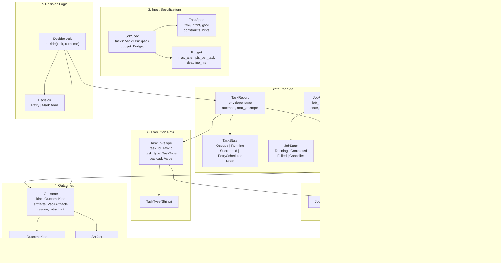

# Weaver Architecture Documentation

**Version**: v1 (2025-12-30)
**Status**: Active Development

## Table of Contents

- [Overview](#overview)
- [Layer Architecture](#layer-architecture)
- [Type System Overview](#type-system-overview)
- [Data Flow](#data-flow)
- [State Transitions](#state-transitions)
- [Core Structures Reference](#core-structures-reference)
- [Usage Examples](#usage-examples)
- [Design Decisions](#design-decisions)

---

## Overview

Weaver is a task execution engine built with the following principles:

- **Strongly-typed IDs**: Prevent mixing different identifier types (JobId, TaskId, AttemptId)
- **Algebraic data types**: Use enums with exhaustive matching to prevent logic gaps
- **Functional decision logic**: Deciders are pure functions (state + observation → next action)
- **Isolated side effects**: Execution (Runners) contains side effects; everything else is pure
- **Full observability**: Every attempt, decision, and outcome is recorded

### Key Characteristics (v1)

- **Single-process**: No distributed coordination
- **In-memory state**: Persistence will be pluggable later
- **Cancellable**: Supports `get_status()` and `cancel_job()` operations
- **Budget-aware**: Respects max attempts, deadlines, and stuck detection

---

## Layer Architecture

```
┌─────────────────────────────────────────────────────────┐
│                    CLI / Application                    │
│                   (weaver-cli crate)                    │
└─────────────────────────────────────────────────────────┘
                           │
                           ▼
┌─────────────────────────────────────────────────────────┐
│                   Runtime / Worker                      │
│         (Orchestration & Concurrent Execution)          │
│   - Runtime: HandlerRegistry + job submission           │
│   - Worker: Lease tasks, execute, report outcomes       │
└─────────────────────────────────────────────────────────┘
                           │
                           ▼
┌─────────────────────────────────────────────────────────┐
│                      Queue Layer                        │
│             (State Management & Scheduling)             │
│   - InMemoryQueue: Task storage & lease                │
│   - TaskRecord: State machine & transitions             │
│   - RetryPolicy: Backoff calculation                    │
└─────────────────────────────────────────────────────────┘
                           │
                           ▼
┌─────────────────────────────────────────────────────────┐
│                     Domain Model                        │
│          (Pure types, no infrastructure)                │
│   - IDs: JobId, TaskId, AttemptId                       │
│   - Specs: JobSpec, TaskSpec, Budget                    │
│   - Outcomes: Outcome, OutcomeKind, Artifact            │
│   - Records: JobRecord, AttemptRecord, DecisionRecord   │
│   - Decisions: Decision, Decider trait                  │
└─────────────────────────────────────────────────────────┘
```

### Layer Responsibilities

| Layer | Responsibility | Key Abstractions |
|-------|---------------|------------------|
| **Domain** | Pure types, business logic, no infrastructure | IDs, Specs, Outcomes, Records |
| **Queue** | State management, scheduling, task lifecycle | TaskRecord, TaskState, InMemoryQueue |
| **Runtime** | Orchestration, handler dispatch, concurrency | Runtime, Worker, HandlerRegistry |
| **CLI/App** | User interface, example implementations | Commands, example handlers |

---

## Type System Overview

### Core Type Categories



---

## Data Flow

### Job Submission to Completion


### Task Lifecycle


---

## State Transitions

### TaskState Transitions


### JobState Transitions


---

## Core Structures Reference

### 1. Identifiers (`domain/ids.rs`)

| Type | Purpose | Representation |
|------|---------|----------------|
| `JobId` | Unit of submission/cancellation/status | Newtype around `u64` |
| `TaskId` | Minimum trackable unit within a Job | Newtype around `u64` |
| `AttemptId` | One execution try of a Task | Newtype around `u64` |

**Design rationale**: Newtype pattern prevents mixing different ID types at compile time (see ADR-0001).

```rust
// Example: Type safety in action
let job_id = JobId::new(1);
let task_id = TaskId::new(1);
// let _: JobId = task_id; // <- Compile error! Cannot mix types
```

### 2. Input Specifications (`domain/spec.rs`)

#### JobSpec

```rust
pub struct JobSpec {
    pub tasks: Vec<TaskSpec>,
    pub budget: Budget,
}
```

- **Purpose**: Unit of submission to the system
- **Lifecycle**: Created by user → Runtime creates JobRecord
- **Flexibility**: Uses `Vec<TaskSpec>` to support multiple tasks per job

#### TaskSpec

```rust
pub struct TaskSpec {
    pub title: Option<String>,
    pub intent: Option<String>,
    pub goal: Option<serde_json::Value>,
    pub constraints: Option<serde_json::Value>,
    pub seed_action_hint: Option<serde_json::Value>,
    pub dependencies_hint: Option<serde_json::Value>,
}
```

- **Purpose**: Declarative description of what needs to be done
- **Flexibility**: Uses `serde_json::Value` for domain-specific fields (v1 design)
- **Evolution**: Can add new fields without breaking existing code

#### Budget

```rust
pub struct Budget {
    pub max_attempts_per_task: u32,
    pub max_total_attempts: Option<u32>,
    pub deadline_ms: Option<u64>,
    pub max_no_progress_steps: Option<u32>,
}
```

- **Purpose**: Execution constraints to prevent infinite loops
- **Defaults**: 5 attempts per task, 50 no-progress steps
- **v1 scope**: Basic attempt limiting; future may add cost budgets

### 3. Execution Data (`domain/task.rs`)

#### TaskEnvelope

```rust
pub struct TaskEnvelope {
    task_id: TaskId,
    task_type: TaskType,
    payload: serde_json::Value,
}
```

- **Purpose**: "Delivery package" for handlers (ID + type + data)
- **Pattern**: Handlers receive this from workers
- **Design**: Immutable; passed by Arc to avoid locks during execution (see ADR-0003)

#### TaskType

```rust
pub struct TaskType(String);
```

- **Purpose**: Handler dispatch key (e.g., "http_request", "shell_command")
- **Pattern**: Runtime uses this to lookup handlers in HandlerRegistry

### 4. Outcomes (`domain/outcome.rs`)

#### Outcome

```rust
pub struct Outcome {
    pub kind: OutcomeKind,
    pub artifacts: Vec<Artifact>,
    pub reason: Option<String>,
    pub retry_hint: Option<serde_json::Value>,
    pub alternatives: Vec<serde_json::Value>,
}
```

- **Purpose**: Unified result format for attempts
- **Three kinds**:
  - `SUCCESS`: Forward progress (final or intermediate)
  - `FAILURE`: Recoverable failure (retry possible)
  - `BLOCKED`: Cannot proceed without intervention
- **Observability**: Artifacts capture stdout, stderr, files, URLs, JSON

#### Artifact

```rust
pub enum Artifact {
    Stdout(String),
    Stderr(String),
    FilePath(String),
    Url(String),
    Json(serde_json::Value),
}
```

- **Purpose**: References to execution outputs/observations
- **Serialization**: Tagged enum (`{"kind":"Stdout","value":"..."}`)

### 5. State Records (`queue/record.rs`, `domain/job.rs`)

#### TaskRecord

```rust
pub struct TaskRecord {
    pub envelope: TaskEnvelope,
    pub state: TaskState,
    pub job_id: Option<JobId>,
    pub attempts: u32,
    pub max_attempts: u32,
    pub last_error: Option<String>,
    pub next_run_at: Option<Instant>,
    pub created_at: Instant,
    pub updated_at: Instant,
}
```

- **Purpose**: Single source of truth for task state (see ADR-0002)
- **Pattern**: All state transitions happen via methods (`start_attempt`, `mark_succeeded`, etc.)
- **Storage**: Queue holds `HashMap<TaskId, TaskRecord>`; ready/scheduled queues hold `TaskId` only (see ADR-0001)

#### TaskState

```rust
pub enum TaskState {
    Queued,           // Ready to run
    Running,          // Being executed
    Succeeded,        // Terminal: success
    RetryScheduled,   // Waiting for backoff
    Dead,             // Terminal: max attempts exceeded
}
```

- **Purpose**: Finite state machine for task lifecycle
- **Terminal states**: `Succeeded`, `Dead` (no further transitions)
- **Runnable states**: `Queued` (eligible for lease)

#### JobRecord

```rust
pub struct JobRecord {
    pub job_id: JobId,
    pub spec: JobSpec,
    pub state: JobState,
    pub task_ids: Vec<TaskId>,
    pub created_at: Instant,
    pub updated_at: Instant,
}
```

- **Purpose**: Collection of tasks with aggregated state
- **Pattern**: State updated via `update_state_from_tasks(&[(TaskId, TaskState)])`
- **Observability**: Timestamps track lifecycle

#### JobState

```rust
pub enum JobState {
    Running,      // At least one task is runnable
    Completed,    // All tasks succeeded
    Failed,       // Some tasks dead, none runnable
    Cancelled,    // User cancelled
}
```

- **Purpose**: Aggregated state from task states
- **Derivation**: Computed from task states, not stored independently

### 6. History Records (`domain/attempt.rs`)

#### AttemptRecord

```rust
pub struct AttemptRecord {
    pub attempt_id: AttemptId,
    pub task_id: TaskId,
    pub action: serde_json::Value,
    pub observation: Vec<Artifact>,
    pub outcome: Outcome,
    pub started_at: Instant,
    pub completed_at: Instant,
}
```

- **Purpose**: Record of a single execution attempt
- **Observability**: Enables "what was tried, what happened" explanations
- **v1 status**: Defined but not yet persisted (future phase)

#### DecisionRecord

```rust
pub struct DecisionRecord {
    pub task_id: TaskId,
    pub trigger: serde_json::Value,
    pub policy: String,
    pub decision: String,
    pub context: Option<serde_json::Value>,
    pub decided_at: Instant,
}
```

- **Purpose**: Record of "next action" choices
- **Observability**: Enables "why did the system decide X" explanations
- **v1 status**: Defined but not yet persisted (future phase)

### 7. Decision Logic (`domain/decision.rs`)

#### Decision

```rust
pub enum Decision {
    Retry { delay: Duration, reason: String },
    MarkDead { reason: String },
}
```

- **Purpose**: Output of Decider (what to do next)
- **v1 scope**: Only retry/stop; future will add Decompose, AddDependency
- **Pattern**: Pure data type (no logic)

#### Decider trait

```rust
pub trait Decider {
    fn decide(&self, task: &TaskRecord, outcome: &Outcome) -> Decision;
}
```

- **Purpose**: Pure function interface for decision logic (see ADR-0005)
- **Pattern**: `current_state + observation → next_action`
- **Extensibility**: Users can implement custom Deciders (AI agents, domain logic)

---

## Usage Examples

### Example 1: Creating and Submitting a Job

```rust
use weaver_core::domain::{JobSpec, TaskSpec, Budget};
use weaver_core::Runtime;

// Create task specifications
let tasks = vec![
    TaskSpec {
        title: Some("Download file".to_string()),
        intent: Some("Fetch data from API".to_string()),
        goal: Some(serde_json::json!({"url": "https://example.com/data.json"})),
        constraints: None,
        seed_action_hint: Some(serde_json::json!({"type": "http_request"})),
        dependencies_hint: None,
    },
    TaskSpec::new("Process downloaded data"),
];

// Create job spec with budget
let job_spec = JobSpec {
    tasks,
    budget: Budget {
        max_attempts_per_task: 3,
        max_total_attempts: Some(10),
        deadline_ms: Some(60_000), // 60 seconds
        max_no_progress_steps: Some(50),
    },
};

// Submit to runtime
let runtime = Runtime::new();
let job_id = runtime.submit_job(job_spec).await?;
println!("Submitted job: {}", job_id);
```

### Example 2: Task Handler Implementation

```rust
use weaver_core::domain::{TaskEnvelope, Outcome, OutcomeKind, Artifact};
use weaver_core::error::WeaverError;
use async_trait::async_trait;

#[async_trait]
trait TaskHandler: Send + Sync {
    async fn execute(&self, task: &TaskEnvelope) -> Result<Outcome, WeaverError>;
}

struct HttpRequestHandler;

#[async_trait]
impl TaskHandler for HttpRequestHandler {
    async fn execute(&self, task: &TaskEnvelope) -> Result<Outcome, WeaverError> {
        let url = task.payload()["url"].as_str()
            .ok_or_else(|| WeaverError::Other("Missing URL".into()))?;

        // Execute HTTP request
        match reqwest::get(url).await {
            Ok(response) => {
                let body = response.text().await.unwrap();
                Ok(Outcome {
                    kind: OutcomeKind::Success,
                    artifacts: vec![Artifact::Stdout(body)],
                    reason: Some("Request succeeded".into()),
                    retry_hint: None,
                    alternatives: vec![],
                })
            }
            Err(e) => {
                Ok(Outcome {
                    kind: OutcomeKind::Failure,
                    artifacts: vec![Artifact::Stderr(e.to_string())],
                    reason: Some("Network error".into()),
                    retry_hint: Some(serde_json::json!({"backoff_ms": 1000})),
                    alternatives: vec![],
                })
            }
        }
    }
}
```

### Example 3: Custom Decider Implementation

```rust
use weaver_core::domain::{Decider, Decision, Outcome, OutcomeKind};
use weaver_core::queue::TaskRecord;
use std::time::Duration;

struct CustomDecider {
    max_retry_delay: Duration,
}

impl Decider for CustomDecider {
    fn decide(&self, task: &TaskRecord, outcome: &Outcome) -> Decision {
        match outcome.kind {
            OutcomeKind::Success => {
                // Should not be called for success, but handle gracefully
                Decision::MarkDead {
                    reason: "Decider called on success".into(),
                }
            }
            OutcomeKind::Failure | OutcomeKind::Blocked => {
                if task.attempts >= task.max_attempts {
                    Decision::MarkDead {
                        reason: format!("Max attempts ({}) exceeded", task.max_attempts),
                    }
                } else {
                    // Exponential backoff: 2^attempts seconds
                    let delay_secs = 2_u64.pow(task.attempts);
                    let delay = Duration::from_secs(delay_secs.min(self.max_retry_delay.as_secs()));

                    Decision::Retry {
                        delay,
                        reason: format!(
                            "Retry {} of {} after {}s",
                            task.attempts + 1,
                            task.max_attempts,
                            delay.as_secs()
                        ),
                    }
                }
            }
        }
    }
}
```

### Example 4: Querying Job Status

```rust
use weaver_core::Runtime;
use weaver_core::domain::JobId;

async fn check_job_status(runtime: &Runtime, job_id: JobId) {
    match runtime.get_status(job_id).await {
        Ok(status) => {
            println!("Job {} status: {:?}", job_id, status.state);
            println!("Tasks: {} total, {} succeeded, {} failed",
                status.total_tasks,
                status.succeeded_tasks,
                status.failed_tasks
            );
        }
        Err(e) => {
            eprintln!("Failed to get status: {}", e);
        }
    }
}
```

### Example 5: State Transition Pattern

```rust
use weaver_core::queue::{TaskRecord, TaskState};
use weaver_core::domain::{TaskEnvelope, TaskId, TaskType};
use std::time::{Duration, Instant};

// Create a new task
let envelope = TaskEnvelope::new(
    TaskId::new(1),
    TaskType::new("example"),
    serde_json::json!({"data": "value"}),
);
let mut task = TaskRecord::new(envelope, 5);

assert_eq!(task.state, TaskState::Queued);
assert_eq!(task.attempts, 0);

// Worker leases and starts execution
task.start_attempt();
assert_eq!(task.state, TaskState::Running);
assert_eq!(task.attempts, 1);

// Handler returns failure → schedule retry
let next_run = Instant::now() + Duration::from_secs(2);
task.schedule_retry(next_run, "Connection timeout".into());
assert_eq!(task.state, TaskState::RetryScheduled);
assert_eq!(task.last_error, Some("Connection timeout".into()));

// Backoff elapsed → requeue
task.requeue();
assert_eq!(task.state, TaskState::Queued);

// Try again
task.start_attempt();
assert_eq!(task.attempts, 2);

// This time succeeds
task.mark_succeeded();
assert_eq!(task.state, TaskState::Succeeded);
assert!(task.state.is_terminal());
```

---

## Design Decisions

This section summarizes key architectural decisions. See individual ADRs for full context.

### ADR-0001: Task ID Only Queue Design

**Summary**: Queue data structures (ready queue, scheduled queue) store `TaskId` only, not full `TaskRecord`.

**Rationale**:
- Avoids lifetime issues with references
- Single source of truth for state (TaskRecord in HashMap)
- Easier to reason about ownership

**Impact**: Queue operations do two-step lookup (ID → Record), but this is acceptable for v1.

**Reference**: `dev/docs/adr/0001-task-id-only-queue-design.md`

### ADR-0002: State Transitions in TaskRecord

**Summary**: All state transitions are methods on `TaskRecord`, not external mutation.

**Rationale**:
- Encapsulation: State changes are consistent and validated
- Single responsibility: TaskRecord owns its state machine
- Observability: `updated_at` timestamp automatically set

**Impact**: Prevents invalid state transitions at compile time.

**Reference**: `dev/docs/adr/0002-state-transitions-in-taskrecord.md`

### ADR-0003: Notify Outside Lock

**Summary**: Never call `notify` or `.await` while holding a lock. Clone/Arc data first.

**Rationale**:
- Prevents deadlocks
- Avoids latency spikes from slow handlers blocking the queue
- Tokio async best practice

**Pattern**:
```rust
// BAD: notify inside lock
{
    let mut queue = self.queue.lock().await;
    queue.push(task);
    self.notify.notify_one(); // <- DEADLOCK RISK
}

// GOOD: notify outside lock
{
    let mut queue = self.queue.lock().await;
    queue.push(task);
} // lock released
self.notify.notify_one(); // <- Safe
```

**Reference**: `dev/docs/adr/0003-notify-outside-lock.md`

### ADR-0004: Tokio Select for Multiple Events

**Summary**: Use `tokio::select!` to handle multiple concurrent events (new tasks, retry timers, shutdown).

**Rationale**:
- Single event loop handles all triggers
- Cancellation-safe for state transitions
- Simplifies worker control flow

**Pattern**:
```rust
loop {
    tokio::select! {
        _ = notify.notified() => {
            // New task available
        }
        _ = tokio::time::sleep_until(next_retry) => {
            // Retry timer fired
        }
        _ = shutdown_rx.recv() => {
            // Shutdown requested
            break;
        }
    }
}
```

**Reference**: `dev/docs/adr/0004-tokio-select-for-multiple-events.md`

### ADR-0005: Decider Architecture

**Summary**: Decision logic is a pure function trait (`Decider`) that returns `Decision` enum.

**Rationale**:
- Separates "what to do next" logic from execution infrastructure
- Enables custom decision strategies (AI agents, domain-specific logic)
- Pure functions are testable and composable
- Follows functional programming principles

**Pattern**:
```rust
pub trait Decider {
    fn decide(&self, task: &TaskRecord, outcome: &Outcome) -> Decision;
}
```

**Impact**: Queue/Worker call Decider to determine next action; Decider has no side effects.

**Reference**: `dev/docs/adr/0005-decider-architecture.md`

### Potential Future ADRs

The following design decisions may warrant ADRs as the system evolves:

1. **Artifact Storage Strategy**: How to store/retrieve large artifacts (files, logs)
2. **Dependency Resolution**: How to handle inter-task dependencies and DAG execution
3. **Decomposition Strategy**: How tasks break down into subtasks
4. **Persistence Layer**: Queue/Record persistence interface design
5. **Distributed Coordination**: When/how to add multi-process support

---

## Appendix: Quick Reference

### File to Structure Mapping

| File | Primary Structures |
|------|-------------------|
| `domain/ids.rs` | JobId, TaskId, AttemptId |
| `domain/spec.rs` | JobSpec, TaskSpec, Budget |
| `domain/outcome.rs` | Outcome, OutcomeKind, Artifact |
| `domain/task.rs` | TaskEnvelope, TaskType |
| `domain/job.rs` | JobRecord, JobState |
| `domain/attempt.rs` | AttemptRecord, DecisionRecord |
| `domain/decision.rs` | Decision, Decider trait |
| `queue/state.rs` | TaskState |
| `queue/record.rs` | TaskRecord |
| `queue/memory.rs` | InMemoryQueue |
| `queue/retry.rs` | RetryPolicy |
| `error.rs` | WeaverError |

### Common Patterns Cheat Sheet

**Creating a task**:
```rust
let envelope = TaskEnvelope::new(task_id, task_type, payload);
let task_record = TaskRecord::new(envelope, max_attempts);
```

**State transitions**:
```rust
task.start_attempt();           // Queued → Running
task.mark_succeeded();          // Running → Succeeded
task.schedule_retry(when, err); // Running → RetryScheduled
task.requeue();                 // RetryScheduled → Queued
task.mark_dead(err);            // Running → Dead
```

**Creating outcomes**:
```rust
Outcome::success()
Outcome::failure("reason")
    .with_artifact(Artifact::Stderr("error".into()))
    .with_retry_hint(serde_json::json!({"delay_ms": 1000}))
```

**Decision logic**:
```rust
impl Decider for MyDecider {
    fn decide(&self, task: &TaskRecord, outcome: &Outcome) -> Decision {
        if task.attempts >= task.max_attempts {
            Decision::MarkDead { reason: "Max attempts".into() }
        } else {
            Decision::Retry { delay: Duration::from_secs(2), reason: "Retry".into() }
        }
    }
}
```

---

**Document Status**: Living document, updated as architecture evolves
**Last Updated**: 2025-12-30
**Next Review**: After Phase 4 completion (Decider integration)
